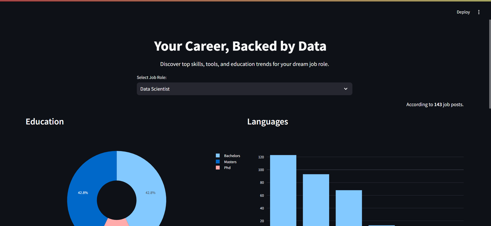
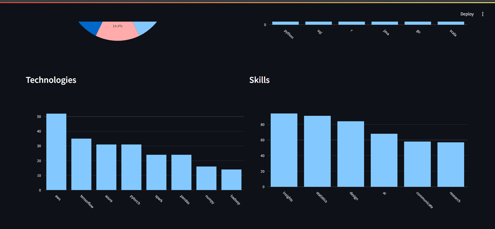

# 📊 Job Skill Trends Analytics Dashboard

A Streamlit-based data analytics dashboard that scrapes job listings, extracts keywords, stores them in a MySQL database, and visualizes trends over each job role.

---

## 🔍 Features

- ✅ Web scraping of live job listings
- ✅ keyword extraction (skills, technologies, languages)
- ✅ MySQL database integration
- ✅ Interactive data visualizations

---

## 🖥️ Live Demo

🌐 https://joblytics.streamlit.app

---

## 📸 Screenshots

---

## 🛠️ Tech Stack

- **Frontend**: Streamlit, Plotly
- **Backend**: Python, Selenium
- **Database**: MySQL

  
